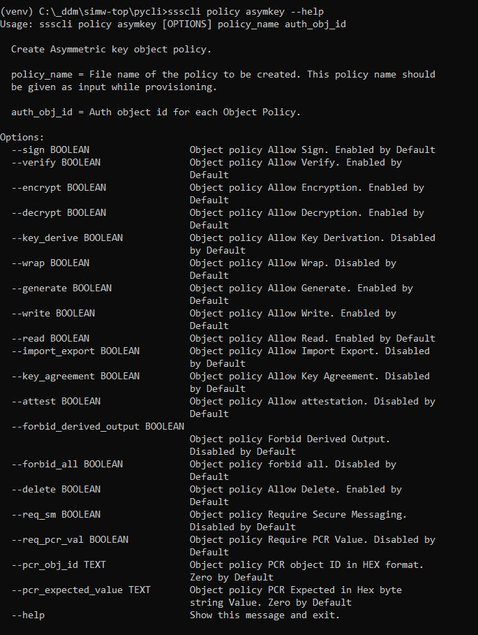
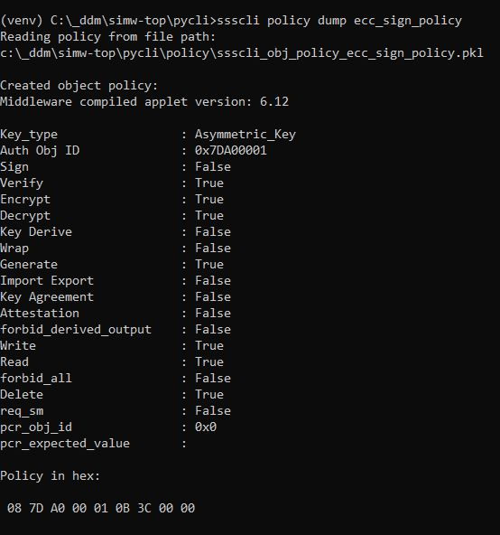
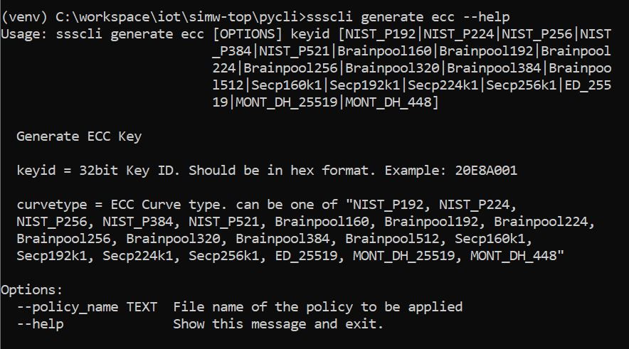

..
    Copyright 2020 NXP

.. highlight:: bat

.. _cli-object-policy:

===========================================================
 Object Policies Through ssscli
===========================================================

Applying policy to objects through ssscli shall be done in two steps.

- Create object policy
- Attach policy to object

Create object policy
^^^^^^^^^^^^^^^^^^^^^^^^^

Object policy shall be created using following command::

    ssscli policy

The create command has ``symkey, asymkey, userid, file, counter`` and  ``pcr`` sub commands.

- ``symkey``         -> Symmetric key object policy (AES, DES, HMAC)
- ``asymkey``        -> Asymmetric key object policy (RSA, EC)
- ``userid``         -> User ID Object Policy
- ``file``           -> Binary file Object Policy
- ``counter``        -> Counter Object Policy
- ``pcr``            -> PCR Object Policy

Each command has mandatory arguments for ``policy_name`` and ``auth_object_id``.

- ``policy_name`` -> Name of the policy to be created. This policy name should be given as input while provisioning.
- ``auth_object_id`` -> Auth object id for each Object Policy

Create policy command shall have following optional arguments based on the sub command selected and applet version of secure element:

- ``--sign`` -> Object policy Allow Sign. Enabled by Default. Parameter type is boolean.
- ``--verify`` -> Object policy Allow Verify. Enabled by Default. Parameter type is boolean.
- ``--encrypt`` -> Object policy Allow Encryption. Enabled by Default. Parameter type is boolean.
- ``--decrypt`` -> Object policy Allow Decryption. Enabled by Default. Parameter type is boolean.
- ``--key_derive`` -> Object policy Allow Key Derivation. Disabled by Default. Parameter type is boolean.
- ``--wrap`` -> Object policy Allow Wrap. Disabled by Default. Parameter type is boolean.
- ``--generate`` -> Object policy Allow Generate. Enabled by Default. Parameter type is boolean.
- ``--write`` -> Object policy Allow Write. Enabled by Default. Parameter type is boolean.
- ``--read`` -> Object policy Allow Read. Enabled by Default. Parameter type is boolean.
- ``--import_export`` -> Object policy Allow Import Export. Disabled by Default. Parameter type is boolean.
- ``--key_agreement`` -> Object policy Allow Key Agreement. Disabled by Default. Parameter type is boolean.
- ``--attest`` -> Object policy Allow attestation. Disabled by Default. Parameter type is boolean.
- ``--desfire_auth`` -> Object policy Allow to perform DESFire authentication. Disabled by Default. Parameter type is boolean.
- ``--desfire_dump`` -> Object policy Allow to dump DESFire session keys. Disabled by Default. Parameter type is boolean.
- ``--forbid_derived_output`` -> Object policy forbid derived output. Disabled by Default. Parameter type is boolean.
- ``--kdf_ext_random`` -> Object policy key derivation external random. Disabled by Default. Parameter type is boolean.
- ``--tls_kdf`` -> Object policy Allow tls kdf. Disabled by Default. Parameter type is boolean.
- ``--tls_pms_kd`` -> Object policy Allow tls pms kd. Disabled by Default. Parameter type is boolean.
- ``--hkdf`` -> Object policy Allow hkdf. Enabled by Default. Parameter type is boolean.
- ``--pbkdf`` -> Object policy Allow pbkdf. Disabled by Default. Parameter type is boolean.
- ``--desfire_kd`` -> Object policy Allow desfire kd. Disabled by Default. Parameter type is boolean.
- ``--forbid_external_iv`` -> Object policy forbid external IV. Disabled by Default. Parameter type is boolean.
- ``--usage_hmac_pepper`` -> Object policy Allow usage hmac as pepper. Disabled by Default. Parameter type is boolean.
- ``--desfire_change_key`` -> Object policy Allow desfire change key. Disabled by Default. Parameter type is boolean.
- ``--derived_input`` -> Object policy Allow derived input. Disabled by Default. Parameter type is boolean.
- ``--desfire_auth_id`` -> 32 bit desfire auth id for desfire_change_key policy. Parameter type is hexdecimal.
- ``--source_key_id`` -> 32 bit source key id for derived_input policy. Parameter type is hexdecimal.
- ``--forbid_all`` -> Object policy forbid all. Disabled by Default. Parameter type is boolean.
- ``--delete`` -> Object policy Allow Delete. Enabled by Default. Parameter type is boolean.
- ``--req_sm`` -> Object policy Allow req_sm. Disabled by Default. Parameter type is boolean.
- ``--req_pcr_val`` -> Object policy Require PCR Value. Disabled by Default. Parameter type is boolean.
- ``--pcr_obj_id`` -> Object policy PCR object ID. Zero by Default. Parameter type is hexdecimal.
- ``--pcr_expected_value`` -> Object policy PCR Expected Value. Zero by Default. Parameter type is hexdecimal byte array.

The created object policy stored in the system in pickle file format.

Command Sample:

Usage example::

    ssscli policy asymkey ecc_sign_policy 0x7DA00001 --sign 0

Created object policy shall be displayed using following command::

    ssscli policy dump <policy_name>

Usage example:

Attach policy to object
^^^^^^^^^^^^^^^^^^^^^^^^^

Created object policy shall be applied it to the object along with generate or set command using ``--policy_name`` optional parameter.

Command Sample:

Usage example::

    ssscli generate ecc 0x20181001 NIST_P256 --policy_name ecc_sign_policy
    ssscli set ecc pair 0x20182010 nistp521_key.pem --policy_name ecc_sign_policy

